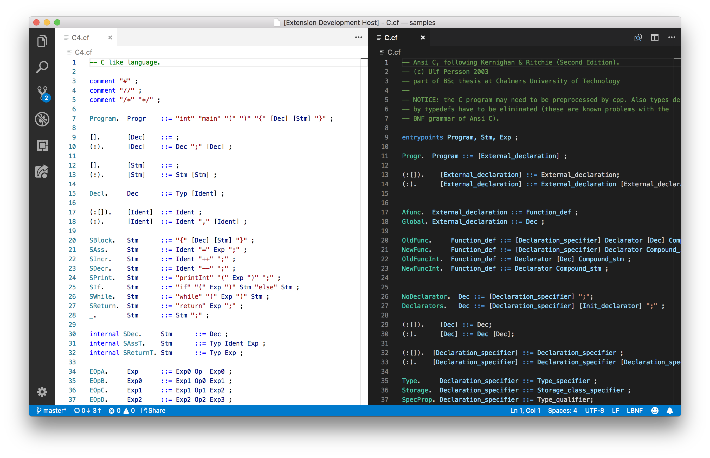

# vscode-lbnf

[](https://marketplace.visualstudio.com/items?itemName=agurodriguez.vscode-lbnf) [](https://marketplace.visualstudio.com/items?itemName=agurodriguez.vscode-lbnf) 

An extension for VS Code which provides support for the [LBNF language](https://github.com/BNFC/bnfc/blob/master/docs/lbnf.rst#appendix-lbnf-specification).

LBNF is acronym for *Labelled BNF*, which is the language used in the compiler construction tool [BNF Converter](https://github.com/BNFC/bnfc).



## Features

* Syntax highlighting

## Installation

- **Visual Studio Marketplace**: Install from the listing: [LBNF — agurodriguez](https://marketplace.visualstudio.com/items?itemName=agurodriguez.vscode-lbnf)
- **Open VSX (VSCodium, etc.)**: Search for "LBNF" in your editor's marketplace, or browse: [Open VSX listing](https://open-vsx.org/extension/agurodriguez/vscode-lbnf) (if available)
- **Manual**: Download the `.vsix` from Releases and install it:

```bash
code --install-extension ./vscode-lbnf-x.y.z.vsix
```

## Usage

- Open any file with the `.cf` extension to get LBNF syntax highlighting.
- Example snippet:

```bnf
EPlus. Exp ::= Exp "+" Exp ;
ENat.  Exp ::= Integer ;
token Integer (digit)+ ;
```

## Development

1. Install dependencies:

```bash
npm install
```

2. Open this folder in VS Code and press F5 to launch an Extension Development Host.

Notes:
- Grammar lives in `syntaxes/lbnf.tmLanguage.json`.
- Language configuration (comments, brackets, auto-closing) is in `language-configuration.json`.

## Packaging

Build a `.vsix` package locally:

```bash
npx @vscode/vsce package
```

This produces a file like `vscode-lbnf-1.0.5.vsix` in the repository root.

## Publishing

There are two stores you can publish to.

### Visual Studio Marketplace (VS Code)

1. Install the CLI:

```bash
npm i -g @vscode/vsce
```

2. Create a Personal Access Token (PAT) on Azure DevOps with scope "Marketplace (publish)" (see "Publishing tokens" below).
3. Sign in once (stores token locally):

```bash
vsce login agurodriguez
```

4. Publish a new version (ensure `version` in `package.json` is bumped):

```bash
vsce publish
```

### Open VSX Registry (for VSCodium, etc.)

1. Install the CLI:

```bash
npm i -g ovsx
```

2. Create an Open VSX token at `https://open-vsx.org` and set it as env var (see "Publishing tokens" below):

```bash
export OVSX_TOKEN=your-token-here
```

3. Publish:

```bash
ovsx publish
```

Alternatively, use the npm scripts:

```bash
npm run package
npm run publish:vsce
npm run publish:ovsx
```

## CI publishing (GitHub Actions)

This repo includes two workflows that run on pushes to `main`/`master`:

- `.github/workflows/publish-vscode.yml` — packages and publishes to the VS Code Marketplace
- `.github/workflows/publish-openvsx.yml` — packages and publishes to Open VSX

Both workflows:
- Upload the built `.vsix` as a build artifact
- Only publish when the `version` in `package.json` changed vs the previous commit

Required repository secrets (Settings → Secrets and variables → Actions):
- `VSCE_PAT`: Azure DevOps PAT with scope "Marketplace (publish)"
- `OVSX_TOKEN`: Open VSX personal access token

## Publishing tokens

### VS Code Marketplace (VSCE_PAT)

1. Ensure you have access to the publisher `agurodriguez` on the [Marketplace](https://marketplace.visualstudio.com/manage) (owner can invite you).
2. Create a PAT in Azure DevOps: [New Token](https://dev.azure.com/) → User Settings → Personal access tokens → New Token
   - Organization: any (or "All accessible organizations")
   - Scopes: enable only "Marketplace (Publish)"
   - Copy the token value
3. Add it to this repo as `VSCE_PAT` under GitHub → Settings → Secrets and variables → Actions.

### Open VSX (OVSX_TOKEN)

1. Sign in at [open-vsx.org](https://open-vsx.org) using GitHub/GitLab.
2. Go to profile → Settings → Tokens, create a token with "Publish" permission: [Token settings](https://open-vsx.org/user-settings/tokens)
3. Add the token to this repo as `OVSX_TOKEN` under GitHub → Settings → Secrets and variables → Actions.

## Release Notes

### 1.0.5

- Fix issue with strings containing a semicolon in rules starting with a keyword

### 1.0.4

- Fix issue with word `nonempty` not being detected when placed next to another keyword

### 1.0.3

- Fix issue detecting single line comments after rules starting with a keyword

### 1.0.2

- Fixed issues detecting categories inside squared brackets
- Fixed issues parsing multiline rules

### 1.0.1

Added keywords for vscode marketplace

### 1.0.0

Initial release
