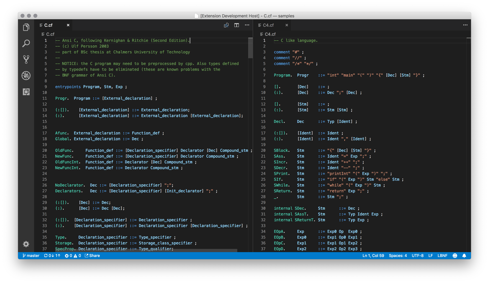

# vscode-lbnf

An extension for VS Code which provides support for the [LBNF language](https://github.com/BNFC/bnfc/blob/master/docs/lbnf.rst#appendix-lbnf-specification).

LBNF is acronym for *Labelled BNF*, which is the language used in the compiler construction tool [BNF Converter](https://github.com/BNFC/bnfc).

## Features

* Syntax highlighting

## Release Notes

### 1.0.2

- Fixed issues detecting categories inside squared brackets
- Fixed issues parsing multiline rules

### 1.0.1

Added keywords for vscode marketplace

### 1.0.0

Initial release